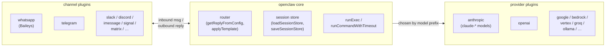
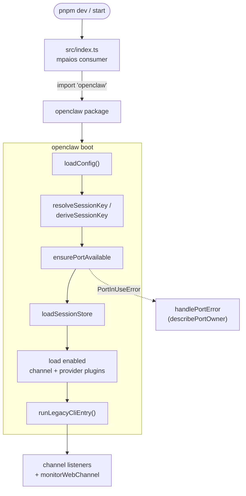
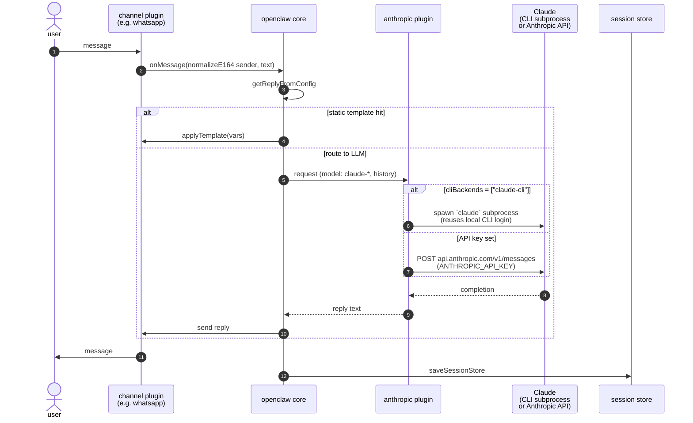
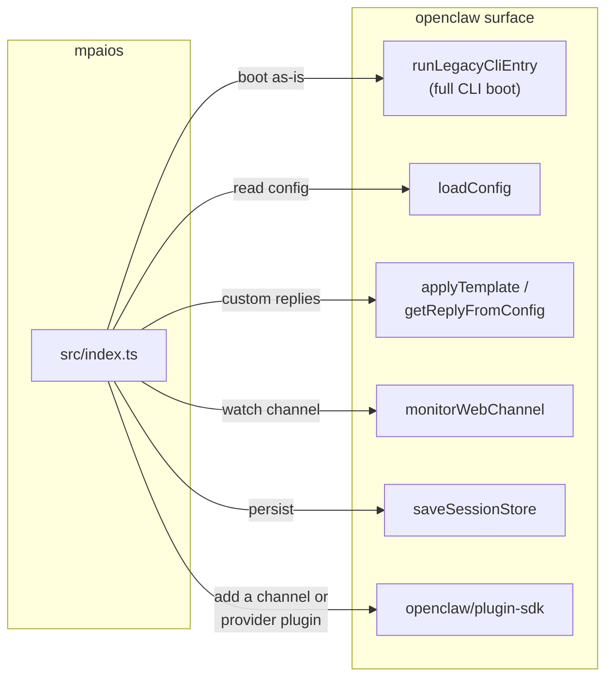
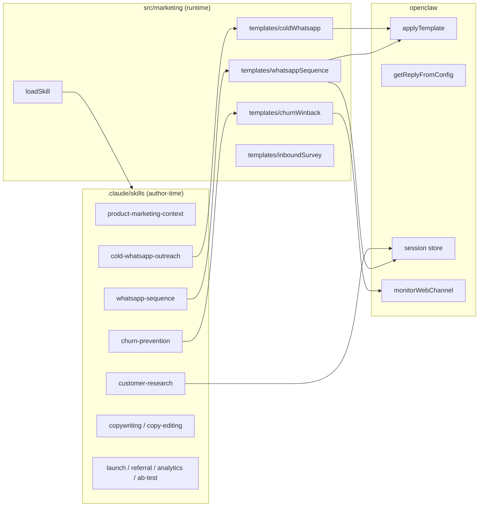
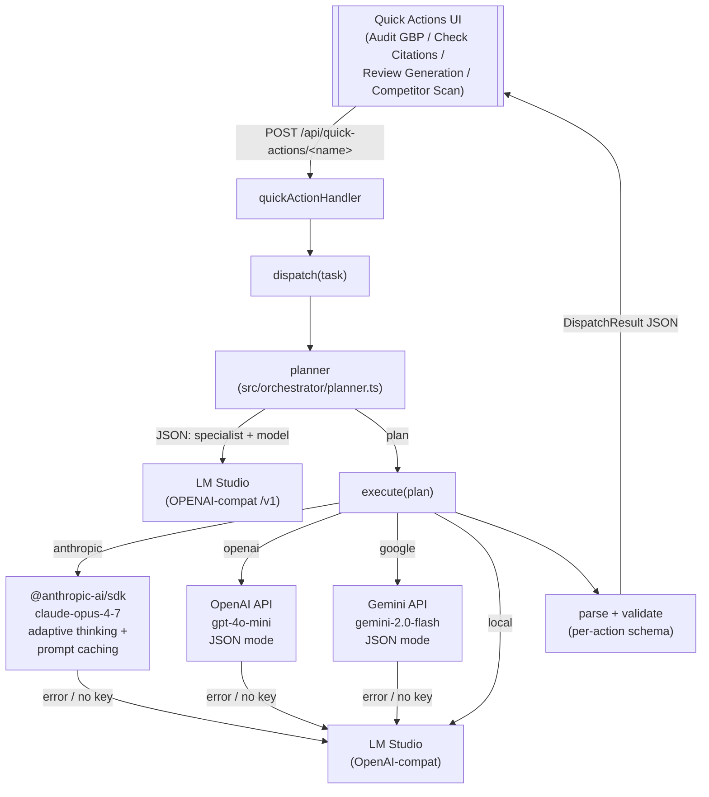

# mpaios ↔ openclaw workflow

Grounded in `openclaw@2026.4.15` — package manifest describes it as a
*"Multi-channel AI gateway with extensible messaging integrations"*.
The name is **open Cla(ude)**: Claude is the brain, openclaw is the
multi-channel body that plugs it into any messaging platform.

## 1. Architecture

openclaw's core is a switchboard. Everything pluggable lives under
`node_modules/openclaw/dist/extensions/` as either a **channel** (where
the user talks) or a **provider** (the LLM doing the thinking).

## 2. Startup

## 3. User question → Claude reply

This is the path for a free-form question (no static template match).

Auth for the anthropic plugin (from
`dist/extensions/anthropic/openclaw.plugin.json`):

- `anthropic-cli` — reuse a local Claude CLI login on this host
  (uses `ANTHROPIC_OAUTH_TOKEN`)
- `api-key` — direct API with `ANTHROPIC_API_KEY` / `--anthropic-api-key`

Model selection is by prefix: any model starting with `claude-` is
routed to the anthropic plugin.

## 4. Where mpaios plugs in

For deep customization (new channel, new provider, new skill), depend
on the `openclaw/plugin-sdk` subpath export rather than hacking on
core.

## 5. Marketing layer

Author-time skills prime Claude Code with mpaios voice and workflows.
Runtime templates compile those workflows into deterministic functions
(`advanceSequence`, `evaluateChurnRisk`, `stepSurvey`) that openclaw
can call from its reply loop.

## 6. Quick Actions orchestrator

Each Quick Action button POSTs to a serverless endpoint under
`api/quick-actions/`. A local LM Studio model plans the request, a
specialist executes it, and the plan falls back to the local model when
a specialist is unreachable or its key is missing.

Defaults per action (overridable by the planner or by env keys):

| Action | Default specialist | Model |
| --- | --- | --- |
| `audit-gbp` | google | `gemini-2.0-flash` |
| `check-citations` | local | LM Studio loaded model |
| `review-generation` | anthropic | `claude-opus-4-7` |
| `competitor-scan` | openai | `gpt-4o-mini` |

The planner is the only mandatory LM Studio call — specialists are
optional and each degrades to local if their key is absent or the
provider errors.
