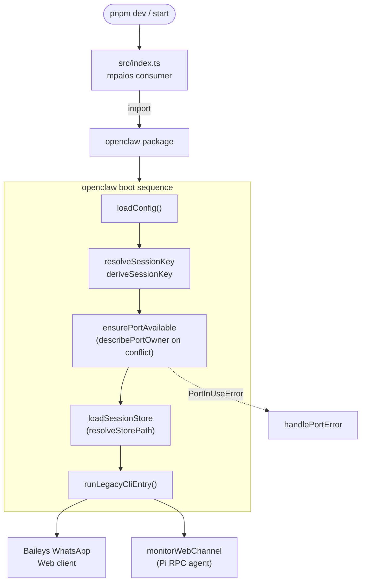
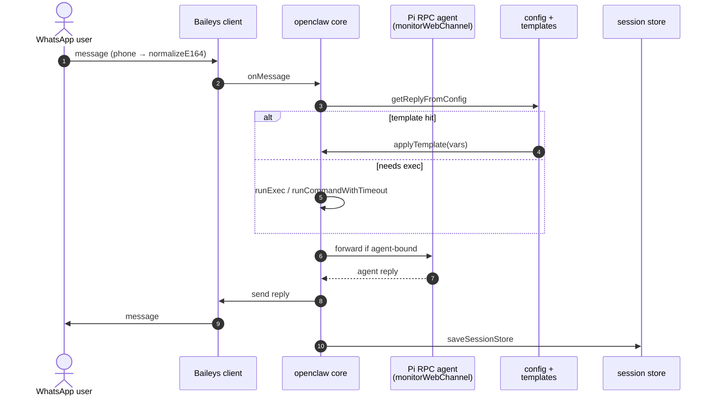
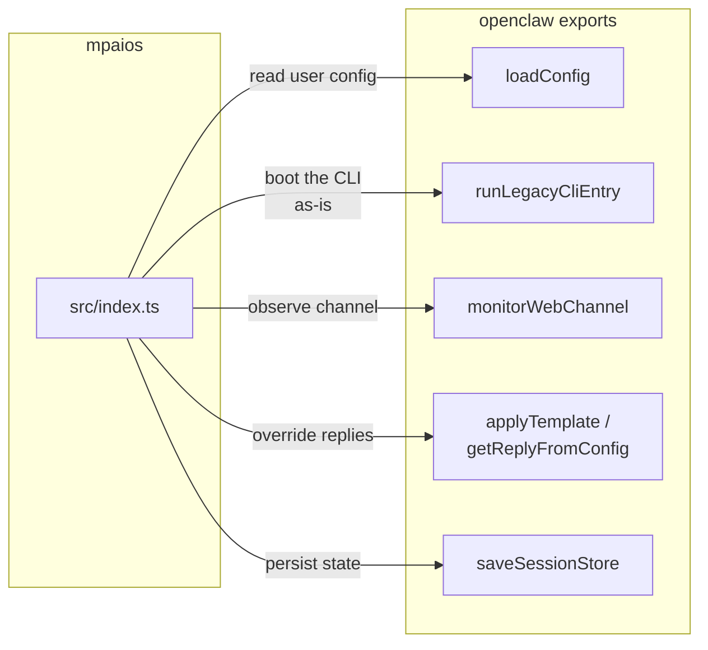

# mpaios ↔ openclaw workflow

Inferred from the public exports of `openclaw@2026.4.15` and its npm
description ("WhatsApp gateway CLI (Baileys web) with Pi RPC agent").
Treat as a map, not a spec — confirm against upstream docs before wiring
production logic.

## 1. Startup

## 2. Inbound message → reply

## 3. Where mpaios plugs in

## Assumptions & caveats

- Export names suggest intent; actual call order and signatures need
  verification against the package source under
  `node_modules/openclaw/dist/`.
- `runLegacyCliEntry` likely encapsulates the full boot + message loop;
  most consumers won't call the lower-level helpers directly.
- The Pi RPC agent is treated as an optional parallel channel; it may be
  gated by config.
